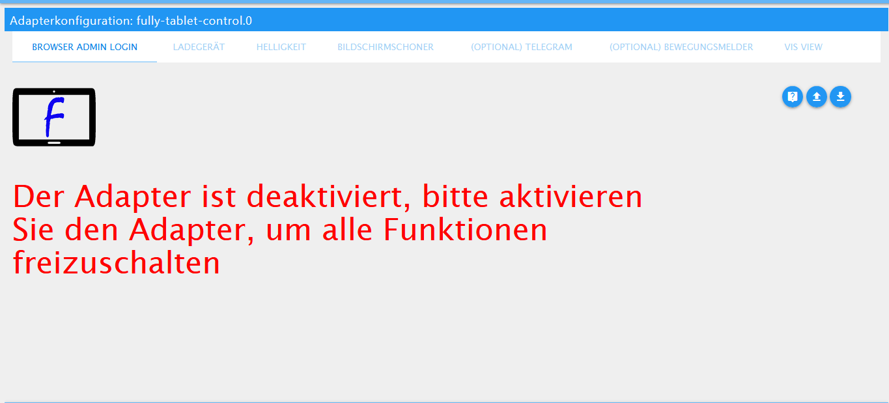
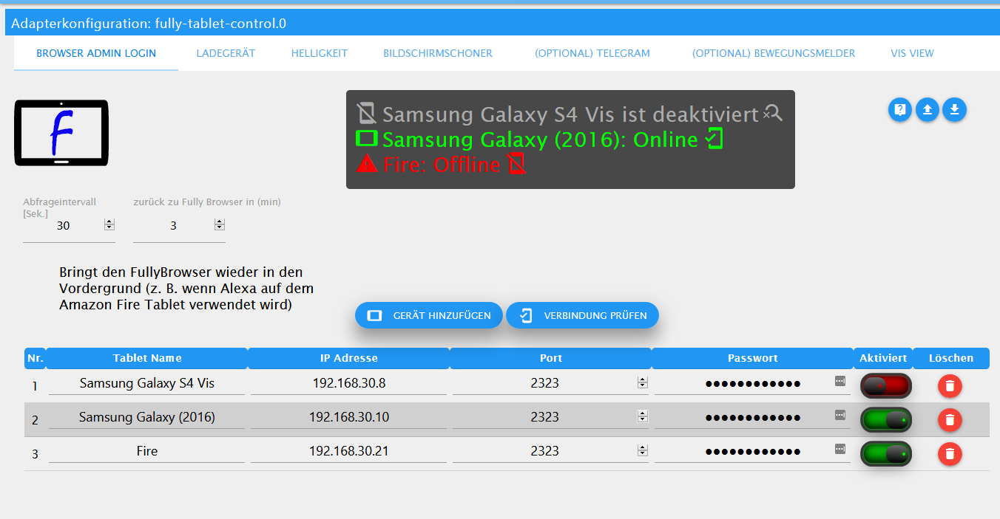

# ioBroker.fully-tablet-control

 
 

<!---->

# Fully Tablet Control Adapter für ioBroker

**This adapter uses the service Sentry.io to automatically report exceptions and code errors and new device schemas to me as the developer.
More details see below! [Sentry](#sentry)**

### Adapter Documentation
A detailed description can be found **[Adapter Documentation](https://xxbjxx.github.io/language/en/Fully-Tablet-Control/description.html)**

## Control your tablet with Fully Kiosk Browser (**Plus License required and Remote Administration must be active and set up**).

### !!! ATTENTION !!! BEFORE CONFIGURING THE ADAPTER MUST BE STARTED OTHERWISE NO CONFIGURATION IS POSSIBLE.

## Browser Admin Login

### Here the tablets are entered, and the query interval is defined

1. query interval set to 30 sec by default (smallest possible value is 10 sec but not recommended).

2. timer in minutes to bring the Fully Browser back to the foreground (recommended for Amazon Fire tablet with Alexa as 
   the Fully Browser is set to the background when Alexa is triggered on the tablet e.g. "Alexa how is the weather today").

3. tablet name is used to create the different tablets in separate folder, if no name is specified the ip address is used as name.

4. ip address of your tablet.

5. here you can enter the port if you have changed it.

6. password of Fully Remote Admin **(Plus License required)**.

7. here you can disable individual tablets so that they are no longer queried.

8. with this button you can start a check if the tablet is reachable, for this you have to enter Ip / Port and Password.
   If a tablet is not immediately accessible, or the answer takes longer a load symbol is indicated then please simply wait, 
   until the result is indicated \
    \
   As soon as the result is available a window will pop up, where you can see which tablet is online or offline.\
   
## For each tablet, which was created on the first page, an entry must be created in the table on the next pages!

## Sentry
### What is Sentry.io and what is reported to the servers of that company?

Sentry.io is a service for developers to get an overview about errors from their applications. And exactly this is
implemented in this adapter.

When the adapter crashes, or another Code error happens, this error message that also appears in the ioBroker log is
submitted to Sentry. When you
allowed iobroker GmbH to collect diagnostic data then also your installation ID (this is just a unique ID without any
additional infos about you, email name or such)
is included. This allows Sentry to group errors and show how many unique users are affected by such an error.
All of this helps me to provide error free adapters that basically never crashs.

For more details and information on how to disable error reporting, please refer to the
[Sentry plugin documentation](https://github.com/ioBroker/plugin-sentry#plugin-sentry)  
Sentry Reporting is used from js-controller 3.0.

_______________________________

## Changelog
<!--
 Placeholder for the next version (at the beginning of the line):
 ### __WORK IN PROGRESS__ ( - falls nicht benötigt löschen sonst klammern entfernen und nach dem - dein text schreiben )
-->

### __WORK IN PROGRESS__
* (xXBJXx) README edited
* (xXBJXx) removed check for batteryLevel = -1% 
* (xXBJXx) camshot function expanded to include continuous shooting [(issue #129)](https://github.com/xXBJXx/ioBroker.fully-tablet-control/issues/129), 
  and it is now possible to take and save multiple images.\
  New tab added in config page 
* (xXBJXx) fixed brightness checkInterval bug (is now checked as intended every x minutes whether the brightness changed)

### 0.3.2-beta.0 (2021-01-24)
* (xXBJXx) fixed problem with ( has no existing object ) for the new JS controller [(issue #114)](https://github.com/xXBJXx/ioBroker.fully-tablet-control/issues/114)
* (xXBJXx) fixed [(issue #120)](https://github.com/xXBJXx/ioBroker.fully-tablet-control/issues/120) check if the screensaver is defined added
* (xXBJXx) fixed brightness control bug 
* (xXBJXx) Added deletion of screenSaver from config [(issue #124)](https://github.com/xXBJXx/ioBroker.fully-tablet-control/issues/124)

### 0.3.1-beta.2 (2021-01-08)
* (xXBJXx) fixed TypeError: Cannot read property 'val' of null [(issue #113)](https://github.com/xXBJXx/ioBroker.fully-tablet-control/issues/113)

### 0.3.1-beta.1 (2021-01-01)
* (xXBJXx) fixed Telegram error message when accessing the config page [(issue #109)](https://github.com/xXBJXx/ioBroker.fully-tablet-control/issues/109)

### 0.3.1-beta.0 (2020-12-31)
* (xXBJXx) test-and-release.yml update
* (xXBJXx) admin Page Revised
* (xXBJXx) check for 0/1 implemented for sockets [(issue #66)](https://github.com/xXBJXx/ioBroker.fully-tablet-control/issues/66)

### 0.3.0-beta.5 (2020-10-24)
* (xXBJXx) reading of the user from telegram adapter instance 0-10 added
* (xXBJXx) Current page added to Device Info

### 0.3.0-beta.4 (2020-10-08)
* (xXBJXx) Motion detector is not defined warning message fixed
 
### 0.3.0-beta.3 (2020-10-08)
* (xXBJXx) fix camshotUrl folder

### 0.3.0-beta.2 (2020-10-06)
* (xXBJXx) Check for invalid batteryLevel added
 
### 0.3.0-beta.0 (2020-10-05)
* (xXBJXx) manual brightness revised
* (xXBJXx) Automatic brightness revised
* (xXBJXx) Manuele brightness expanded to include the afternoon control
* (xXBJXx) config page revised
* (xXBJXx) add StartUrl command
* (xXBJXx) add command motionDetection on/Off
* (xXBJXx) add command camshot and 2 states for Image (base64 and imageURl)
* (xXBJXx) change README

### 0.2.15

* (xXBJXx) add media Volume

### 0.2.14

* (xXBJXx) bug fix

### 0.2.12

* (xXBJXx) screensaver brightness control can be switched on or off
* (xXBJXx) dependencies updates

### 0.2.11

* (xXBJXx) add new charge option
* (Steff42) Fix typo in words.js

### 0.2.10

* (xXBJXx) request log output adjusted

### 0.2.9

* (xXBJXx) night brightness manual change added

### 0.2.8

* (xXBJXx) bug in brightness control and charging function fixed

### 0.2.7

* (xXBJXx) Astro time added

### 0.2.6

* (xXBJXx) Brightness control changed and Configuration page changed

### 0.2.5

* (xXBJXx) FullyBrowser implemented
* (xXBJXx) fixed some bugs

### 0.2.4

* (xXBJXx) Screen saver time adjusted now in 1 min steps
* (xXBJXx) State_of_charge adjusted
* (xXBJXx) interval limit added
* (xXBJXx) Switch charging control on / off added
* (xXBJXx) Brightness activated individually

### 0.2.2

* (xXBJXx) Adapter Name Change

### 0.2.0

* (xXBJXx) charging warning message output adjusted

### 0.1.9

* (xXBJXx) bug in Automatic change to home view widget 8 fixed

### 0.1.8

* (xXBJXx) add Automatic change to home view

### 0.1.5

* (xXBJXx) brightness bug fix

### 0.1.4

* (xXBJXx) manuell StateChange optimized

### 0.1.3

* (xXBJXx) Configuration page changed

### 0.1.2

* (xXBJXx) log level adjusted

### 0.1.1

* (xXBJXx) README.md edit

### 0.1.0

* (xXBJXx) Beta Release

### 0.0.8

* (xXBJXx) device activate added
* (xXBJXx) bug fixes

### 0.0.7

* (xXBJXx) back to Fully Browser implemented
* (xXBJXx) bug fixes

### 0.0.6

* (xXBJXx) Screensaver selection implemented
* (xXBJXx) Motion detector added

### 0.0.5

* (xXBJXx) manual brightness control implemented
* (xXBJXx) Screensavers added

### 0.0.4

* (xXBJXx) request optimized for multiple devices
* (xXBJXx) brightness control implemented

### 0.0.3

* (xXBJXx) Charging function optimized
* (xXBJXx) Added selection screen for continuous operation
* (xXBJXx) Telegram warning added

### 0.0.2

* (xXBJXx) added charging function

### 0.0.1

* (xXBJXx) initial release

## License

MIT License

Copyright (c) 2021 xXBJXx

Permission is hereby granted, free of charge, to any person obtaining a copy
of this software and associated documentation files (the "Software"), to deal
in the Software without restriction, including without limitation the rights
to use, copy, modify, merge, publish, distribute, sublicense, and/or sell
copies of the Software, and to permit persons to whom the Software is
furnished to do so, subject to the following conditions:

The above copyright notice and this permission notice shall be included in all
copies or substantial portions of the Software.

THE SOFTWARE IS PROVIDED "AS IS", WITHOUT WARRANTY OF ANY KIND, EXPRESS OR
IMPLIED, INCLUDING BUT NOT LIMITED TO THE WARRANTIES OF MERCHANTABILITY,
FITNESS FOR A PARTICULAR PURPOSE AND NONINFRINGEMENT. IN NO EVENT SHALL THE
AUTHORS OR COPYRIGHT HOLDERS BE LIABLE FOR ANY CLAIM, DAMAGES OR OTHER
LIABILITY, WHETHER IN AN ACTION OF CONTRACT, TORT OR OTHERWISE, ARISING FROM,
OUT OF OR IN CONNECTION WITH THE SOFTWARE OR THE USE OR OTHER DEALINGS IN THE
SOFTWARE.
