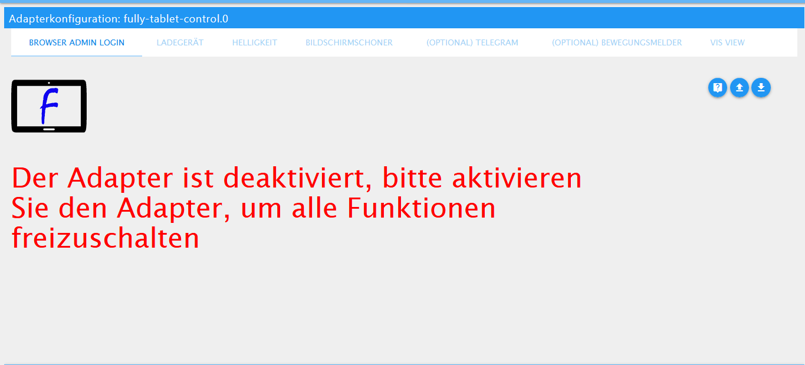
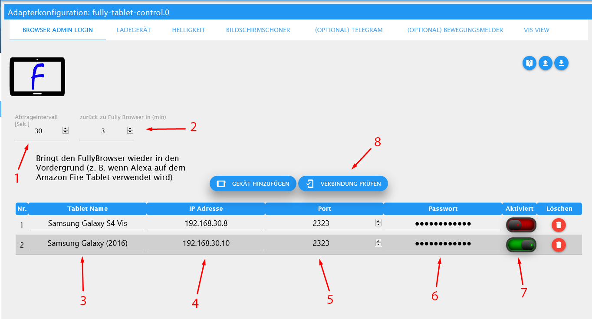
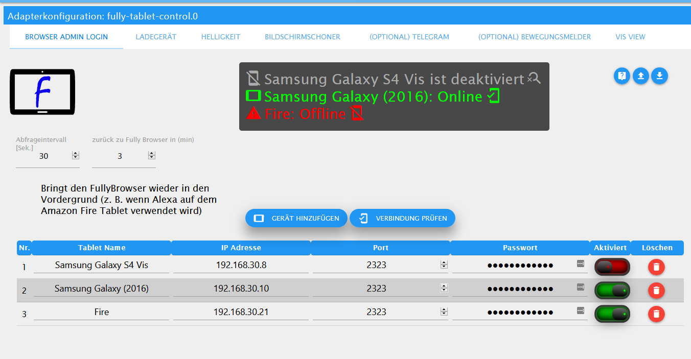

# ioBroker.fully-tablet-control

<!---->

# Fully Tablet Control Adapter für ioBroker

**This adapter uses the service Sentry.io to automatically report exceptions and code errors and new device schemas to me as the developer. More
details see below! [Sentry](#sentry)**

### Adapter Documentation

A detailed description can be found **[Adapter Documentation](https://xxbjxx.github.io/language/en/Fully-Tablet-Control/01.description.html)**

## Control your tablet with Fully Kiosk Browser (**Plus License required and Remote Administration must be active and set up**).

### !!! ATTENTION !!! BEFORE CONFIGURING THE ADAPTER MUST BE STARTED OTHERWISE NO CONFIGURATION IS POSSIBLE.

## Browser Admin Login

### Here the tablets are entered, and the query interval is defined

1. query interval set to 30 sec by default (smallest possible value is 10 sec but not recommended).

2. timer in minutes to bring the Fully Browser back to the foreground (recommended for Amazon Fire tablet with Alexa as the Fully Browser is set to
   the background when Alexa is triggered on the tablet e.g. "Alexa how is the weather today").

3. tablet name is used to create the different tablets in separate folder, if no name is specified the ip address is used as name.

4. ip address of your tablet.

5. here you can enter the port if you have changed it.

6. password of Fully Remote Admin **(Plus License required)**.

7. here you can disable individual tablets so that they are no longer queried.

8. with this button you can start a check if the tablet is reachable, for this you have to enter Ip / Port and Password. If a tablet is not
   immediately accessible, or the answer takes longer a load symbol is indicated then please simply wait, until the result is indicated \
    \
   As soon as the result is available a window will pop up, where you can see which tablet is online or offline.\
   

## For each tablet, which was created on the first page, an entry must be created in the table on the next pages!

## Sentry

### What is Sentry.io and what is reported to the servers of that company?

Sentry.io is a service for developers to get an overview about errors from their applications. And exactly this is implemented in this adapter.

When the adapter crashes, or another Code error happens, this error message that also appears in the ioBroker log is submitted to Sentry. When you
allowed iobroker GmbH to collect diagnostic data then also your installation ID (this is just a unique ID without any additional infos about you,
email name or such)
is included. This allows Sentry to group errors and show how many unique users are affected by such an error. All of this helps me to provide error
free adapters that basically never crashs.

For more details and information on how to disable error reporting, please refer to the
[Sentry plugin documentation](https://github.com/ioBroker/plugin-sentry#plugin-sentry)  
Sentry Reporting is used from js-controller 3.0.

_______________________________

## Changelog

<!--
 Placeholder for the next version (at the beginning of the line):
 ### __WORK IN PROGRESS__ ( - falls nicht benötigt löschen sonst klammern entfernen und nach dem - dein text schreiben )
-->

### __WORK IN PROGRESS__

* (xXBJXx) fixed [(issue #222)](https://github.com/xXBJXx/ioBroker.fully-tablet-control/issues/222)
* (xXBJXx) test-and-release.yml update
* (xXBJXx) dependencies updates
* (xXBJXx) License year adjusted to 2022

### 0.3.6-1 (2021-06-10)

* (xXBJXx) change Adapter Documentation link [(issue #193)](https://github.com/xXBJXx/ioBroker.fully-tablet-control/issues/193)

### 0.3.6-0 (2021-05-27)

* (xXBJXx) State "s" has no existing object message fixed [(issue #184)](https://github.com/xXBJXx/ioBroker.fully-tablet-control/issues/184)

### 0.3.5-0 (2021-05-25)

* (xXBJXx) Brightness changeMode optimized
* (xXBJXx) Adapter tier set to 3
* (xXBJXx) dependencies updates
* (xXBJXx) Check if adapter config is valid modified
* (xXBJXx) check and testing for Node.js 16 and closed [(issue #170)](https://github.com/xXBJXx/ioBroker.fully-tablet-control/issues/170)

### 0.3.4-0 (2021-04-30)

* (xXBJXx) dependencies updates
* (xXBJXx) fixed wrong type of displayWidthPixels and
  displayHeightPixels [(issue #164)](https://github.com/xXBJXx/ioBroker.fully-tablet-control/issues/164)
* (xXBJXx) add encodeUrl and change log message

### 0.3.3-beta.0 (2021-02-14)

* (xXBJXx) README edited
* (xXBJXx) removed check for batteryLevel = -1%
* (xXBJXx) camshot function expanded to include continuous shooting [(issue #129)](https://github.com/xXBJXx/ioBroker.fully-tablet-control/issues/129)
  , and it is now possible to take and save multiple images.\
  New tab added in config page
* (xXBJXx) fixed brightness checkInterval bug (is now checked as intended every x minutes whether the brightness changed)

## License

MIT License

Copyright (c) 2022 xXBJXx

Permission is hereby granted, free of charge, to any person obtaining a copy of this software and associated documentation files (the "Software"), to
deal in the Software without restriction, including without limitation the rights to use, copy, modify, merge, publish, distribute, sublicense, and/or
sell copies of the Software, and to permit persons to whom the Software is furnished to do so, subject to the following conditions:

The above copyright notice and this permission notice shall be included in all copies or substantial portions of the Software.

THE SOFTWARE IS PROVIDED "AS IS", WITHOUT WARRANTY OF ANY KIND, EXPRESS OR IMPLIED, INCLUDING BUT NOT LIMITED TO THE WARRANTIES OF MERCHANTABILITY,
FITNESS FOR A PARTICULAR PURPOSE AND NONINFRINGEMENT. IN NO EVENT SHALL THE AUTHORS OR COPYRIGHT HOLDERS BE LIABLE FOR ANY CLAIM, DAMAGES OR OTHER
LIABILITY, WHETHER IN AN ACTION OF CONTRACT, TORT OR OTHERWISE, ARISING FROM, OUT OF OR IN CONNECTION WITH THE SOFTWARE OR THE USE OR OTHER DEALINGS
IN THE SOFTWARE.
