# ioBroker.fully-tablet-control

[](https://www.npmjs.com/package/iobroker.fully-tablet-control) 
[](https://www.npmjs.com/package/iobroker.fully-tablet-control) 


[](https://david-dm.org/xXBJXx/iobroker.fully-tablet-control)

[](https://nodei.co/npm/iobroker.fully-tablet-control/)

**Tests:**: [](https://travis-ci.org/xXBJXx/ioBroker.fully-tablet-control)

# Fully Tablet Control Adapter für ioBroker

## Steuern Sie Ihr Tablet mit dem Fully Kiosk Browser **(Plus License erforderlich)**

# !!! ACHTUNG Beta Release !!!

## Browser Admin Login

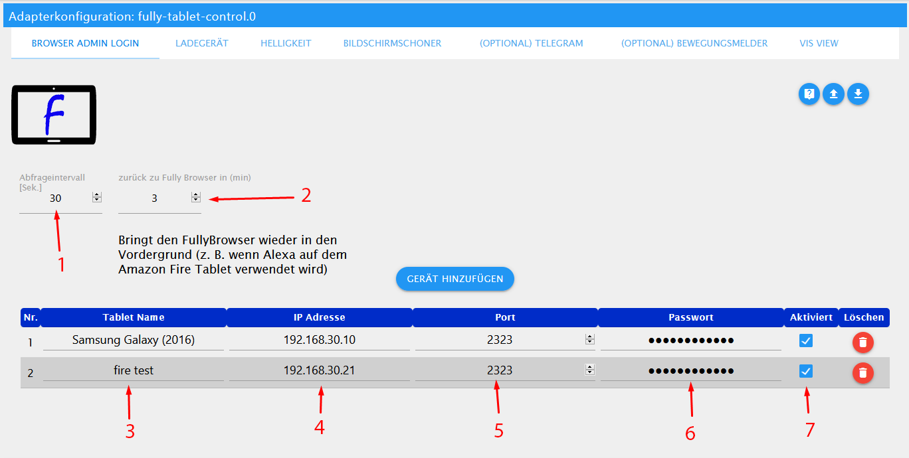

### Hier werden die Tablets eingetragen und der Abfrageintervall festgelegt

1. Abfrageintervall standardmäßig auf 30 sec eingestellt.

2. Timer in Minuten, um den Fully Browser wieder in den Vordergrund zu holen (empfohlen für Amazon Fire Tablet mit Alexa da der Fully Browser in den Hintergrund gesetzt wird, wenn Alexa auf dem Tablet getriggert wird Z.B. "Alexa wie ist das Wetter heute").

3. Tablet Name wird verwendet, um die verschiedenen Tablets in separaten Ordner zu erstellen, wenn kein Name angegeben wird wir die Ip Adresse als Name versendet.

4. Ip Adresse von deinem Tablet.

5. Hier kann man den Port eintragen falls man ihn geändert hat.

6. Password von Fully Remote Admin **(Plus License erforderlich)**.

7. Hier könne einzelne Tablets ausgeschaltet werden so das diese nicht mehr abgefragt werden.

## Für Jedes Tablet, das auf der ersten Seite angelegt wurde, muss auf den nächsten Seiten ein Eintrag in der Tabelle angelegt werden!

## Ladegerät

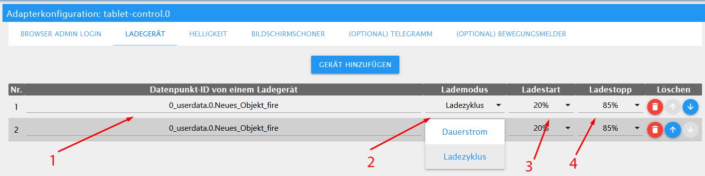

Hier muss die ID von dem Ladegerät eingetragen werden damit das Tablet geladen werden kann.

1. Nicht Ausfülen wird automatisch nach einem reload ausgefült.

2. Ladesteuerung Einschalten oder ausschalten wen ausgeschaltet ignoriert der Adapter alles was mit dem laden des Tablets zu tun hat es werden auch keine Warnungen bei schwacher Batterie ausgegeben.

3. Datenpunkt ID (aus den Iobroker Objekten) von dem Ladegerät.

4. Lademodus auswählbar sind **Dauerstrom** oder **Ladezyklus** bei beiden muss die **ID eingetragen sein**  bei Dauerstrom wird das Tablet dauerhaft am Strom gehalten und bei Ladezyklus wird das Tablet z.B. bei 20% anfangen zu laden und bei 85% das Laden abschalten. \
Bei der Auswahl **aus** wird die Ladesteuerung für dieses Tablet ausgeschaltet es muss auch keine **ID** eingetragen werden.
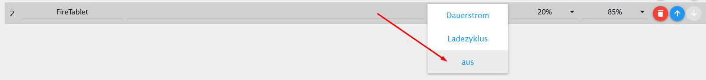

5. **(nur für Ladezyklus relevant)** Ladestart ab dieser grenze startet das Tablet das laden.

6. **(nur für Ladezyklus relevant)** Ladestopp bis zu den diesen Wert wird das Tablet aufgeladen.

## Helligkeit

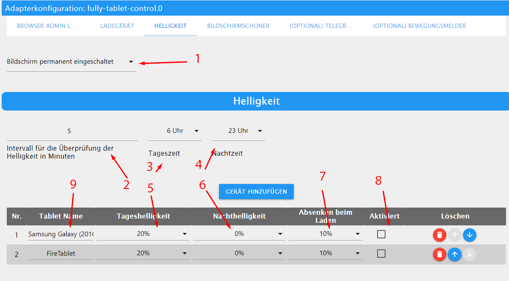

Hier wird die Helligkeit von dem Tablet eingestellt.

1. hier kann man entscheiden ob der Bildschirm dauerhaft an bleiben soll, selbst wenn man auf den ausschalt Knopf drückt wird der Bildschirm wieder eingeschaltet.

2. Intervall für die Prüfung der Helligkeit in Minuten.

3. Uhrzeit wann das Tablet auf die unter Nr.: **5** eingestellte Tageshelligkeit eingestellt werden soll.

4. Uhrzeit wann das Tablet auf die unter Nr.: **6** eingestellte Nachthelligkeit eingestellt werden soll.

5. Tageshelligkeit Einstellung.

6. Nachthelligkeit Einstellung.

7. Hier wird die Absenkung der Helligkeit eingestellt wen das Tablet am Laden ist damit es schneller aufgeladen wird.

8. hier kann man die Helligkeit Steuerung Admin und manuell ausschalten es wird dann die Standard Helligkeit vom Tablett benutzt.

9. Nicht Ausfülen wird automatisch nach einem reload ausgefült.

10. hier kann man entscheiden wie man die Helligkeit steuern will über die Konfigurationsseite mit Möglichkeit die Steuerung Manuel zu verändern dazu **MUSS** die Tabelle unten angelegt werden, oder generell alles auf Manuell zuschalten dann braucht man die Tabelle unten nicht und die Zeit Steuerung funktioniert dann auch nicht die Helligkeit wird dann nur noch über den Datenpunkt in den Objekten veränderbar sein.
11. Umschalten zwischen Astro Zeit und Manuelle Zeit.

12. AstroZeit für den Tag.

13. AstroZeit für die Nacht

## Bildschirmschoner

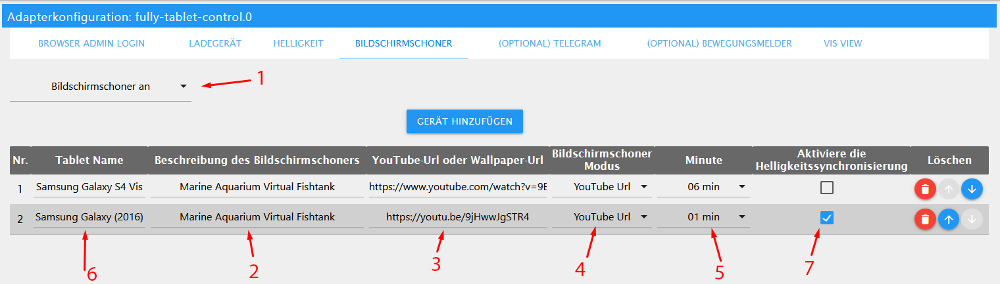

Hier wird der Bildschirmschoner eingestellt.

1. Bildschirmschoner einschalten oder Ausschalten auswählen damit den Tablets der Bildschirmschoner eingeschaltet wird.

2. Beschreibung des Bildschirmschoners dient nur zur Info was für ein Bildschirmschoner eingestellt ist.

3. YouTube URL oder Wallpaper URL Hier kann eine YouTube Video URL eingetragen werden z.B. ein Aquarium bei Wallpaper URL kann ein Bild als Bildschirmschoner eingestellt werden.

4. Hier muss man auswählen was für eine URL man verwendet.

5. Timer wann der Bildschirmschoner starten soll

6. Nicht Ausfülen wird automatisch nach einem reload ausgefült.

7. Damit wird die Screensaver Helligkeitssynchronisierung aktiviert das bedeutet das die Screensaver Helligkeit an  die Helligkeit an die Helligkeit Einstellung vom Tablet angeglichen wird z.B. Tagsüber 45% und nachts 0%.

## (Optional) Telegramm

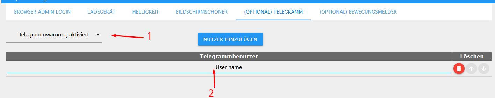

Hier werden die Telegramm User eingestellt, die die Warnung erhalten sollen, die gesendet wird, wen ein Tablet nicht geladen wird und unter 18% fällt.

1. Telegrammwarnungen aktivieren oder deaktivieren wen die Warnung deaktivieren ist werden trotzdem die Warnung im Iobroker log ausgegeben.

2. Telegrammbenutzer Hier werden die User Namen vom Telegramm eingetragen.

## (Optional) Bewegungsmelder

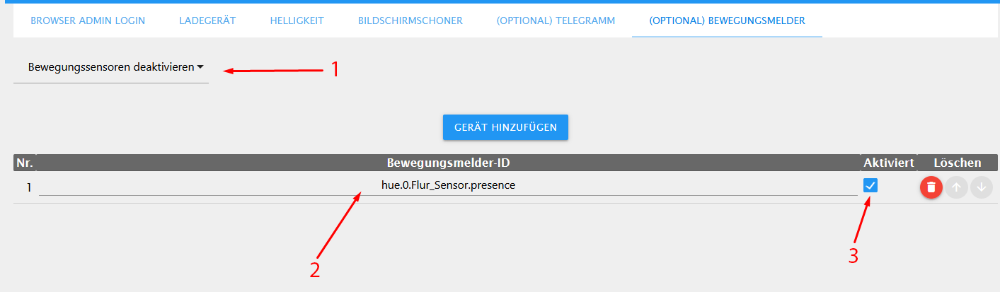

Hier kann man externe Bewegungsmelder eintragen, die den Bildschirmschoner abschalten sollen.

1. Bewegungsmelder Aktiviren oder deaktivieren, wenn ausgeschaltet wird der Bildschirmschoner nach der eingestellten Zeit gestartet und bleibt aktiv bis er durch Berührung ausgeschaltet wird  

2. Bewegungsmelder ID hier kommt die Bewegungsmelder ID, wenn nur eine ID eingetragen wird werden alle Tablets von diesem Bewegungsmelder geschaltet.

3. wenn mehrere Bewegungsmelder eingetragen wurden kann man über diese Schaltfläche die einzeln abschalten.

## Objects

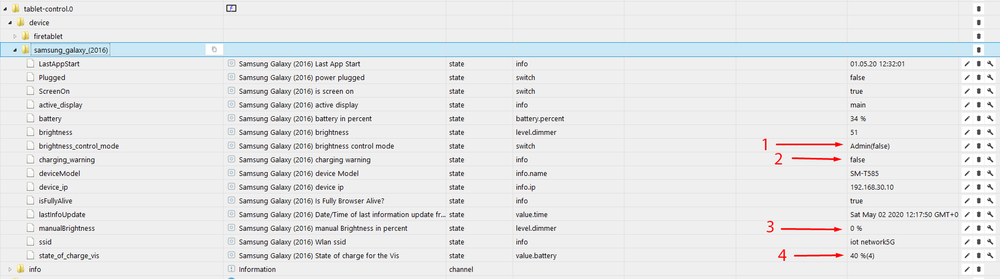

* bei den erstellten Datenpunkten kann man die Helligkeit manuell einstellen dazu muss man zuerst bei punkt **1** von Admin auch User wechseln dann kann man bei punkt **3** die Helligkeit manuell verändern dies ist nur für die Tages Helligkeit nicht für die Nacht.

* unter Punkt **2** wird bei einer Warnung, wenn das Tablet nicht auflädt ein **true** wert gesetzt.

* bei punkt **4** wird der aktuelle Batterie stand für eine vis anzeige geschrieben z.B. **[ basic-Image 8 Widget]**
beim normalen bertieb wird nur die % zahl geschriben z.B. **10%** wen das tablet am laden ist wird **charge 10 %** angezeigt.

```
0 = 0%
1 = 10%
2 = charge 10%
3 = 20%
4 = charge 20%
5 = 30%
6 = charge 30%
7 = 40%
8 = charge 40%
9 = 50%
10 = charge 50%
11 = 60%
12 = charge 60%
13 = 70%
14 = charge 70%
15 = 80%
16 = charge 80%
17 = 90%
18 = charge 90%
19 = 100%
20 = charge 100%
```

hier noch ein Beispiel basic-Image 8 Widget:

<details><summary>basic-Image 8 Widget</summary>
<p>

Muster mit allen Batterieständen:

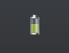

```

 [{"tpl":"tplStatefulImage8","data":{"oid":"fully-tablet-control.0.device.eingang.state_of_charge_vis","g_fixed":false,"g_visibility":false,"g_css_font_text":false,"g_css_background":false,"g_css_shadow_padding":false,"g_css_border":false,"g_gestures":false,"g_signals":false,"g_last_change":false,"visibility-cond":"==","visibility-val":1,"visibility-groups-action":"hide","refreshInterval":"0","count":"20","signals-cond-0":"==","signals-val-0":true,"signals-icon-0":"/vis/signals/lowbattery.png","signals-icon-size-0":0,"signals-blink-0":false,"signals-horz-0":0,"signals-vert-0":0,"signals-hide-edit-0":false,"signals-cond-1":"==","signals-val-1":true,"signals-icon-1":"/vis/signals/lowbattery.png","signals-icon-size-1":0,"signals-blink-1":false,"signals-horz-1":0,"signals-vert-1":0,"signals-hide-edit-1":false,"signals-cond-2":"==","signals-val-2":true,"signals-icon-2":"/vis/signals/lowbattery.png","signals-icon-size-2":0,"signals-blink-2":false,"signals-horz-2":0,"signals-vert-2":0,"signals-hide-edit-2":false,"lc-type":"last-change","lc-is-interval":true,"lc-is-moment":false,"lc-format":"","lc-position-vert":"top","lc-position-horz":"right","lc-offset-vert":0,"lc-offset-horz":0,"lc-font-size":"12px","lc-font-family":"","lc-font-style":"","lc-bkg-color":"","lc-color":"","lc-border-width":"0","lc-border-style":"","lc-border-color":"","lc-border-radius":10,"lc-zindex":0,"src_11":"/icons-open-icon-library-png/status/battery-060.png","src_10":"/icons-open-icon-library-png/status/battery-charging-050.png","src_9":"/icons-open-icon-library-png/status/battery-050.png","src_8":"/icons-open-icon-library-png/status/battery-charging-040.png","src_7":"/icons-open-icon-library-png/status/battery-040.png","src_6":"/icons-open-icon-library-png/status/battery-charging-030.png","src_5":"/icons-open-icon-library-png/status/battery-030.png","src_4":"/icons-open-icon-library-png/status/battery-charging-020.png","src_3":"/icons-open-icon-library-png/status/battery-020.png","src_2":"/icons-open-icon-library-png/status/battery-charging-010.png","src_1":"/icons-open-icon-library-png/status/battery-010.png","src_0":"/icons-open-icon-library-png/status/battery-000.png","src_13":"/icons-open-icon-library-png/status/battery-070.png","src_15":"/icons-open-icon-library-png/status/battery-080.png","src_17":"/icons-open-icon-library-png/status/battery-090.png","src_19":"/icons-open-icon-library-png/status/battery-100.png","src_20":"/icons-open-icon-library-png/status/battery-charging-100.png","src_18":"/icons-open-icon-library-png/status/battery-charging-090.png","src_16":"/icons-open-icon-library-png/status/battery-charging-080.png","src_14":"/icons-open-icon-library-png/status/battery-charging-070.png","src_12":"/icons-open-icon-library-png/status/battery-charging-060.png"},"style":{"left":"177px","top":"76px","width":"44px","height":"43px"},"widgetSet":"basic"}]
```
HEX Verwendet wird open icons library


</p>
</details>

Unter Nr.**5** ist ein state als Button, der bewirkt das alle Tablets die aktiv sind die View neu laden.

Unter Nr.**6** sind die Fully Browser Info states zu finden.

Unter Nr.**7** könnt ihr die Fully Browser commands nutzen.

## Automatischer Wechsel auf Home View

unter Vis View kann man seine Views von der Vis eintragen und die Zeit, nach der sie wieder auf die Home View wechseln sollen.

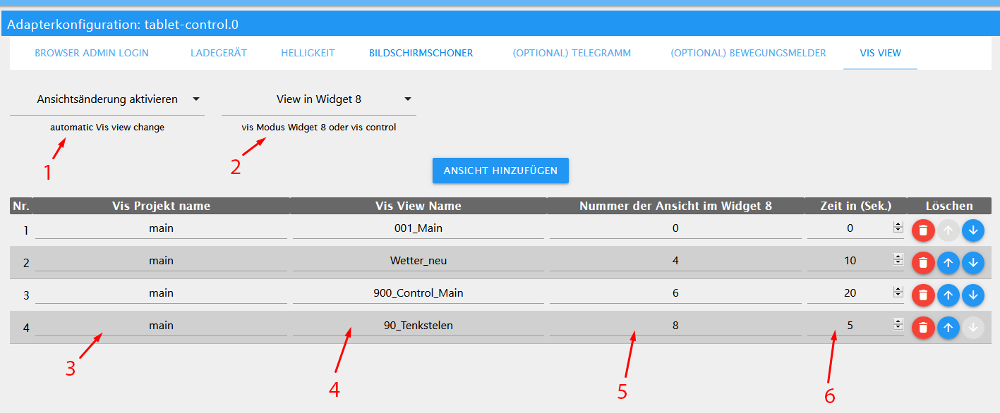

1. Einschalten oder Ausschalten der Automatische Änderung der Vis-Ansicht.

2. Auswählen welche View Methode man verwendet Widget 8 wird z.B. bei (**Material Design Widgets (Top App Bar verwendet)**).

3. hier wird euer Project eingetragen wer nicht weiß wo man es findet hier z.B:
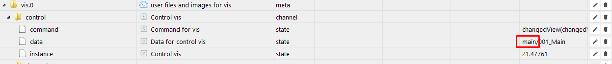
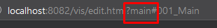

4. hier kommt die View rein die oberste also **Nr.: 1 ist immer die Home View**.

5. hier kommt die Nummer der **Widget 8 View** rein die erste ist wie bei Nr.: 4 immer die Home View.

6. hier kommt nun die Zeit rein in Sekunden.

## Vis View Objekte

hier sind 2 Dp.

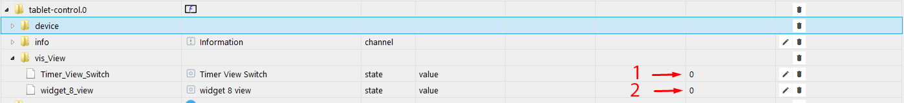

1. hier ist der Timer der die Rest Zeit anzeigt.

2. das ist der Dp für die Widget 8 View's.

_______________________________

## Changelog

### 0.2.12

* (xXBJXx) screensaver brightness control can be switched on or off
* (xXBJXx) dependencies updates

### 0.2.11

* (xXBJXx) add new charge option
* (Steff42) Fix typo in words.js

### 0.2.10

* (xXBJXx) request log output adjusted

### 0.2.9

* (xXBJXx) night brightness manual change added

### 0.2.8

* (xXBJXx) bug in brightness control and charging function fixed

### 0.2.7

* (xXBJXx) Astro time added

### 0.2.6

* (xXBJXx) Brightness control changed and Configuration page changed

### 0.2.5

* (xXBJXx) FullyBrowser implemented
* (xXBJXx) fixed some bugs

### 0.2.4

* (xXBJXx) Screen saver time adjusted now in 1 min steps
* (xXBJXx) State_of_charge adjusted
* (xXBJXx) interval limit added
* (xXBJXx) Switch charging control on / off added
* (xXBJXx) Brightness activated individually

### 0.2.2

* (xXBJXx) Adapter Name Change

### 0.2.0

* (xXBJXx) charging warning message output adjusted

### 0.1.9

* (xXBJXx) bug in Automatic change to home view widget 8 fixed

### 0.1.8

* (xXBJXx) add Automatic change to home view

### 0.1.5

* (xXBJXx) brightness bug fix

### 0.1.4

* (xXBJXx) manuell StateChange optimized

### 0.1.3

* (xXBJXx) Configuration page changed

### 0.1.2

* (xXBJXx) log level adjusted

### 0.1.1

* (xXBJXx) README.md edit

### 0.1.0

* (xXBJXx) Beta Release

### 0.0.8

* (xXBJXx) device activate added
* (xXBJXx) bug fixes

### 0.0.7

* (xXBJXx) back to Fully Browser implemented
* (xXBJXx) bug fixes

### 0.0.6

* (xXBJXx) Screensaver selection implemented
* (xXBJXx) Motion detector added

### 0.0.5

* (xXBJXx) manual brightness control implemented
* (xXBJXx) Screensavers added

### 0.0.4

* (xXBJXx) request optimized for multiple devices
* (xXBJXx) brightness control implemented

### 0.0.3

* (xXBJXx) Charging function optimized
* (xXBJXx) Added selection screen for continuous operation
* (xXBJXx) Telegram warning added

### 0.0.2

* (xXBJXx) added charging function

### 0.0.1

* (xXBJXx) initial release

## License

MIT License

Copyright (c) 2020 xXBJXx <alienware.games@gmail.com>

Permission is hereby granted, free of charge, to any person obtaining a copy
of this software and associated documentation files (the "Software"), to deal
in the Software without restriction, including without limitation the rights
to use, copy, modify, merge, publish, distribute, sublicense, and/or sell
copies of the Software, and to permit persons to whom the Software is
furnished to do so, subject to the following conditions:

The above copyright notice and this permission notice shall be included in all
copies or substantial portions of the Software.

THE SOFTWARE IS PROVIDED "AS IS", WITHOUT WARRANTY OF ANY KIND, EXPRESS OR
IMPLIED, INCLUDING BUT NOT LIMITED TO THE WARRANTIES OF MERCHANTABILITY,
FITNESS FOR A PARTICULAR PURPOSE AND NONINFRINGEMENT. IN NO EVENT SHALL THE
AUTHORS OR COPYRIGHT HOLDERS BE LIABLE FOR ANY CLAIM, DAMAGES OR OTHER
LIABILITY, WHETHER IN AN ACTION OF CONTRACT, TORT OR OTHERWISE, ARISING FROM,
OUT OF OR IN CONNECTION WITH THE SOFTWARE OR THE USE OR OTHER DEALINGS IN THE
SOFTWARE.
